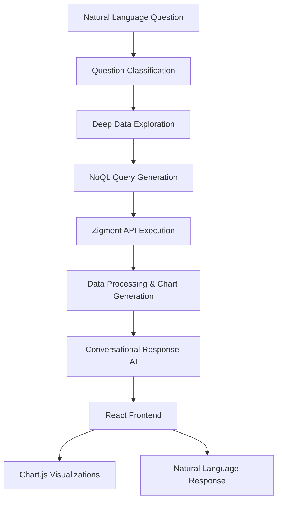

# Conversational CRM Analytics Platform

> Transform natural language questions into beautiful, data-driven insights with AI-powered charts and conversational responses.

[](https://www.python.org)
[](https://nextjs.org)
[](https://openai.com)
[](https://zigment.ai)

## 🌟 What Makes This Special?

This isn't just another database query tool. It's an **intelligent CRM analytics platform** that:

- 🧠 **Understands context** - Ask complex questions in plain English about your CRM data
- 📈 **Creates beautiful visualizations** - Generates exactly one relevant chart per question
- 💬 **Conversational responses** - Get friendly, natural explanations like talking to a colleague
- 🎯 **CRM-focused insights** - Optimized for leads, contacts, conversions, and engagement data
- 🚀 **Zero technical knowledge required** - Natural language to business insights in seconds
- 🔒 **Secure** - All API keys and sensitive data properly protected

## 🎥 See It In Action

**Input:** *"What are the leads by status?"*

**AI-Generated Output:**

Looking at your current pipeline, I can see the leads are spread across different stages pretty evenly. Most of them are actively being worked on, which is good - you've got movement in the funnel.

```chart
{"type": "bar", "question": "Distribution of leads by status", "title": "Leads by Status", "db": "zigment"}
```

What's interesting is that you have a good mix of leads in progress and converted ones. The fact that you're seeing leads move through the stages suggests your follow-up process is working. You might want to focus on pushing those in-progress ones toward conversion if possible.

## 🚀 Quick Start

### Prerequisites

- **Python 3.8+** with pip
- **Node.js 16+** with npm  
- **Zigment API access** for NoQL database queries
- **OpenAI API Key** ([Get one here](https://platform.openai.com/api-keys))

### ⚡ 30-Second Setup

1. **Clone & Navigate**
   ```bash
   git clone <your-repo-url>
   cd langchain+zigment
   ```

2. **Environment Setup**
   ```bash
   # Copy environment template
   cp .env.example .env
   
   # Add your API keys to .env
   OPENAI_API_KEY=your_openai_api_key_here
   ZIGMENT_API_KEY=your_zigment_api_key_here
   ```

3. **Backend Setup**
   ```bash
   cd backend
   pip install -r requirements.txt
   ```

4. **Frontend Setup**
   ```bash
   cd ../frontend
   npm install
   ```

### 🏃‍♂️ Launch the Platform

#### Option 1: One-Click Start (Windows)
```bash
# Start backend
start_backend.bat

# Start frontend (new terminal)
start_frontend.bat
```

#### Option 2: Manual Start
```bash
# Terminal 1: Backend
cd backend && python app.py

# Terminal 2: Frontend
cd frontend && npm run dev
```

### 🌐 Access Your Platform

- **🎨 Main App:** http://localhost:3000
- **🔧 API:** http://localhost:5000  
- **❤️ Health Check:** http://localhost:5000/health

## 💡 Try These Questions

### 🏢 CRM Analytics
- *"What are the leads by status?"*
- *"Which lead sources perform best?"*
- *"Show me conversion trends over time"*
- *"What times of day see the most contact activity?"*
- *"Which communication channels are most effective?"*
- *"What's the breakdown by lifecycle stage?"*

### 📊 Business Intelligence
- *"How many contacts does each organization have?"*
- *"Show me the most common event types"*
- *"What are the top performing agents?"*
- *"Which campaigns have the highest engagement?"*

## 🏗️ Architecture & AI Flow



### 🧠 AI Intelligence Features

1. **Smart Chart Selection**: 
   - Automatically generates exactly one relevant chart per question
   - Chooses optimal chart type (bar, line, pie) based on data characteristics
   - Prevents chart overload with intelligent limiting

2. **Conversational Responses**: 
   - Friendly, natural language explanations
   - Business-focused insights and recommendations
   - Contextual understanding of CRM operations

3. **Data Exploration**: 
   - Proactive data discovery before generating responses
   - Fact-gathering to ensure accurate insights
   - Smart entity recognition for proper data references

4. **NoQL Integration**: 
   - Direct integration with Zigment's NoQL database
   - Optimized query generation for document databases
   - Real-time data access and processing

## 🛠️ Technology Stack

| **🔧 Backend** | **🎨 Frontend** |
|---|---|
| **Flask** - Web framework | **Next.js 14** - React framework |
| **Custom LLM Implementation** - Optimized AI orchestration | **TypeScript** - Type safety |
| **OpenAI GPT-4o-mini** - AI reasoning | **Tailwind CSS** - Modern styling |
| **Zigment API** - NoQL database access | **Chart.js** - Data visualization |
| **python-dotenv** - Environment management | **Axios** - HTTP requests |
| **Flask-CORS** - Cross-origin support | **ReactMarkdown** - Markdown rendering |

## 📁 Project Structure

```
langchain+zigment/
├── 🔧 backend/
│   ├── app.py                 # Main Flask application with AI logic
│   ├── ChatOpenAI.py         # Custom OpenAI integration
│   ├── noqlgen.py            # NoQL query generation
│   ├── requirements.txt      # Python dependencies
│   ├── charts/              # Generated chart images
│   └── static/charts/       # Static chart assets
├── 🎨 frontend/
│   ├── app/
│   │   ├── components/
│   │   │   └── ChartComponent.tsx  # Main visualization component
│   │   ├── page.tsx         # Main application page
│   │   └── layout.tsx       # App layout and styling
│   ├── package.json         # Node.js dependencies
│   └── tailwind.config.js   # Styling configuration
├── 📊 noqlsyntax/
│   ├── aggregates.md         # NoQL aggregation functions
│   ├── comparison-operators.md
│   ├── date-functions.md
│   └── ...                  # Complete NoQL documentation
├── 🔒 .env.example          # Environment template (create .env from this)
├── .gitignore               # Git security configuration
└── 📖 README.md             # This comprehensive guide
```

## ⚙️ Configuration

### 🔐 Environment Variables

Create `.env` in the root directory (copy from `.env.example`):

```env
# OpenAI Configuration
OPENAI_API_KEY=your_openai_api_key_here

# Zigment API Configuration
ZIGMENT_API_KEY=your_zigment_api_key_here

# Flask Configuration
FLASK_ENV=development
FLASK_DEBUG=True
```

### 🗄️ Database Configuration

The platform uses Zigment's NoQL API for data access. No local database setup required - just ensure you have:

1. Valid Zigment API key
2. Access to your CRM data through Zigment
3. Proper API permissions for data queries

## 🎯 API Reference

### Core Endpoints

| Method | Endpoint | Description |
|--------|----------|-------------|
| `GET` | `/health` | System health check |
| `POST` | `/api/ask` | Natural language to insights |
| `GET` | `/api/schema` | Database schema information |
| `POST` | `/api/execute-query` | Execute raw NoQL query |
| `GET` | `/api/conversations` | List conversation history |
| `POST` | `/api/conversations` | Create new conversation |
| `GET` | `/api/history` | Get conversation messages |
| `DELETE` | `/api/conversations/:id` | Delete conversation |

### Example API Usage

```bash
# Ask a question
curl -X POST http://localhost:5000/api/ask \
  -H "Content-Type: application/json" \
  -d '{
    "question": "What are the leads by status?",
    "conversation_id": "optional-conversation-id"
  }'
```

## 🔍 Advanced Features

### 🎨 Smart Visualization Rules

- **Bar Charts**: Perfect for comparing categories (status, sources, channels)
- **Line Charts**: Ideal for trends over time (conversion rates, activity patterns)
- **Pie Charts**: Great for showing proportions (channel distribution, stage breakdown)
- **Automatic Limiting**: Charts are intelligently limited to prevent information overload

### 💬 Conversational Intelligence

The AI generates:
- **Natural Opening**: Acknowledges the question with context
- **Data Walkthrough**: Explains findings in conversational language
- **Key Insights**: Highlights important patterns and trends
- **Actionable Recommendations**: Suggests next steps based on data

### 🚫 Anti-Redundancy System

Prevents repetitive or similar charts:
- Each question gets exactly one chart (unless explicitly requested otherwise)
- Charts are optimized for the specific question asked
- No duplicate visualizations of the same data

## 🐛 Troubleshooting

<details>
<summary><strong>🔑 API Key Issues</strong></summary>

**Problem**: `ERROR: OPENAI_API_KEY environment variable is not set!`

**Solutions**:
1. Create `.env` file in project root with your API keys
2. Verify API keys are valid and have proper permissions
3. Check for typos in environment variable names
4. Restart both backend and frontend after adding keys

</details>

<details>
<summary><strong>🌐 CORS Issues</strong></summary>

**Problem**: `Access to XMLHttpRequest has been blocked by CORS policy`

**Solutions**:
1. Backend includes CORS support for localhost:3000
2. If using different ports, update CORS configuration in `app.py`
3. Check if both frontend and backend are running

</details>

<details>
<summary><strong>📦 Dependency Issues</strong></summary>

**Problem**: `ModuleNotFoundError` or `Cannot find module`

**Solutions**:
1. Backend: `cd backend && pip install -r requirements.txt`
2. Frontend: `cd frontend && npm install`
3. Use virtual environment for Python dependencies
4. Clear npm cache: `npm cache clean --force`

</details>

<details>
<summary><strong>🔌 Zigment API Issues</strong></summary>

**Problem**: API connection or authentication errors

**Solutions**:
1. Verify your Zigment API key is correct
2. Check API permissions and rate limits
3. Ensure your CRM data is properly connected to Zigment
4. Test API access independently first

</details>

## 🔒 Security & Best Practices

### 🛡️ Environment Security
- ✅ API keys in `.env` file (never committed to git)
- ✅ Comprehensive `.gitignore` protection
- ✅ No hardcoded credentials in source code
- ✅ CORS properly configured for production

### 🏗️ Production Deployment
- Use production WSGI server (not Flask dev server)
- Set `FLASK_ENV=production`
- Use environment-specific `.env` files
- Enable HTTPS for API endpoints
- Rotate API keys regularly

## 🤝 Contributing

We welcome contributions! Here's how:

1. **Fork** the repository
2. **Create** a feature branch: `git checkout -b amazing-feature`
3. **Make** your changes with tests
4. **Commit** with clear messages: `git commit -m 'Add amazing feature'`
5. **Push** to your branch: `git push origin amazing-feature`
6. **Submit** a pull request

### 🧪 Development Guidelines

- Follow PEP 8 for Python code
- Use TypeScript for frontend components
- Add comprehensive error handling
- Test with various CRM data scenarios
- Update documentation for new features
- Never commit API keys or sensitive data

## 📄 License

This project is open source and available under the [MIT License](LICENSE).

## 🙏 Acknowledgments

- **OpenAI** for GPT-4o-mini language model
- **Zigment** for NoQL database API
- **Chart.js** for beautiful data visualizations
- **Next.js** for the amazing React framework
- **LangChain** for AI orchestration patterns

---

<div align="center">

**🎉 Ready to turn your CRM data into actionable insights? Get started now! 🚀**

[⭐ Star this repo](https://github.com/your-repo) • [🐛 Report issues](https://github.com/your-repo/issues) • [💡 Request features](https://github.com/your-repo/issues)

</div>